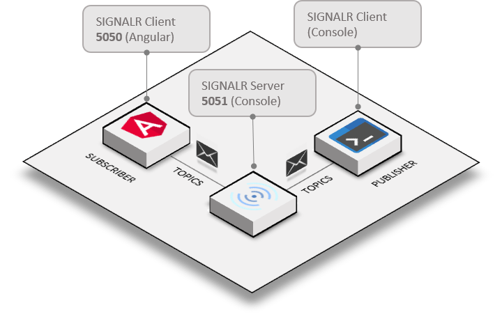

# SIGNALR Event Hub
Generic event messaging hub mainly for front end signalling if an asycnhronous task has completed in the backend. This runs via websockets. There are 3 websocket node types.

The main goal of this setup is to update the User Interface when tasks categorized in topics complete their work. Also live chat can be supported with this setup.

1. The SIGNALR Server contains a generic hub for multicasting topics to connected client.
2. The SIGNALR Client Console publishes events on topics
3. The SIGNALR Client Angular UI front end is the subscriber to these topic

## Status

The project is under construction. The nodes currently show simple event messaging and CORS is currently setup.

## Built With

* [VSCODE](https://code.visualstudio.com/) - The IDE used
* [DOCKER](https://www.docker.com/) - Build, Ship, and Run Any App, Anywhere

## Contributing

Pull requests are accepted

## Authors

* **Sjef van Leeuwen** - *Initial work* - [github](https://github.com/sjefvanleeuwen)

## License

This project is licensed under the GPL-V3 License - see the [LICENSE.md](LICENSE.md) file for details
